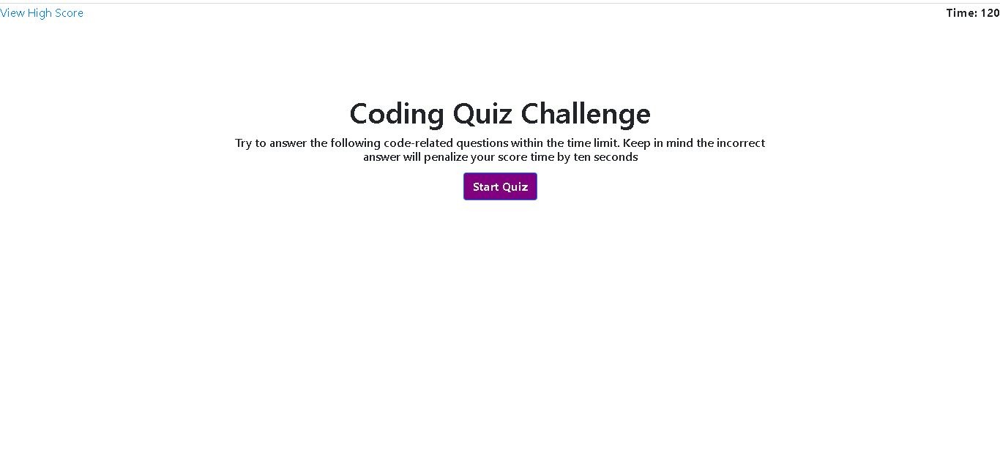
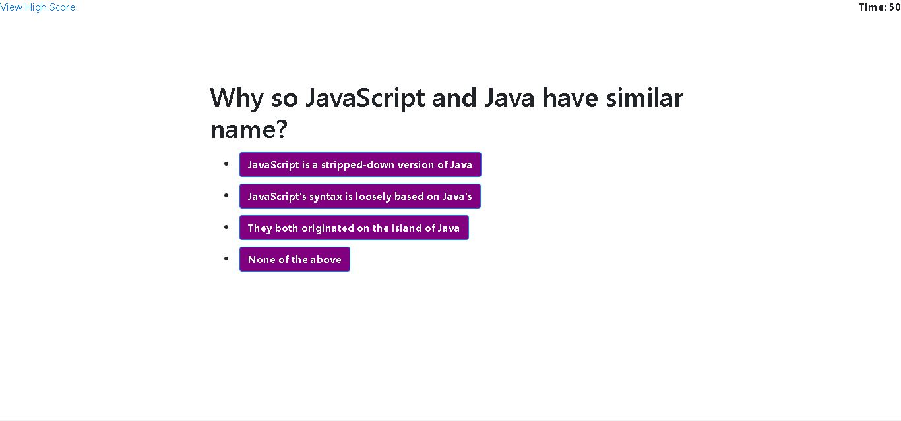
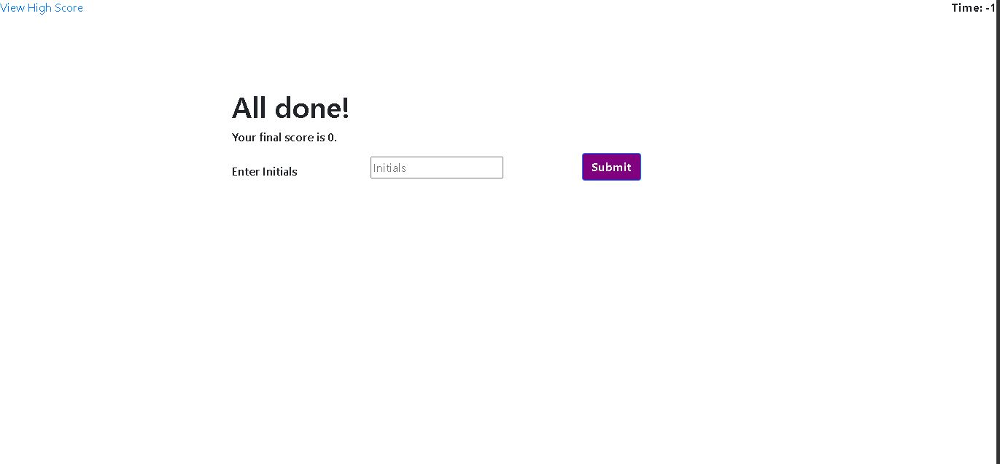
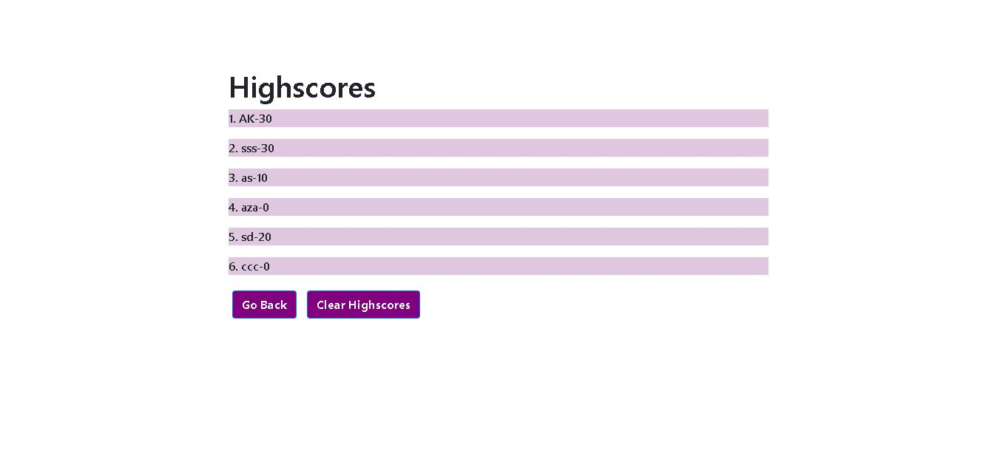

# Java Script Quiz

This application will be used by candidates to test their skills in JavaScript multiple choice questions (MCQ).

At first the following html pages are using bootstrap & Css :
- Landing page
- Question page
- Completion page
- View Score page

Then Java script is written to make the application responsive. Below steps are followed to complete the application :

1.  ### <ins>Landing Page</ins>

- Display landing page with timer on right side, view high score on left side.
- When the start button is clicked it takes the user to the Question page.
- When the "view High Score" button is clicked it takes the user to "Highscores" page.

2.  ### <ins>Question Page</ins>

- The timer starts once the page is loaded
- This page has questions with multiple options given. 
- The user need to click an option to select the answer.
- once the answer is clicked , on the footer it will be displayed if the answer is "correct" or "wrong".
- When time is completed or user has completed answering all the questions it moves to the next page. 

3.  ### <ins>Completion Page</ins>

- User need to provide initials and press submit button.
- Once the "submit" button is pressed , initial with the final score is stored in the local storage .
And the "Highscores" page is displayed.

4.  ### <ins>Highscores Page</ins>

- This page displays all the high-scores.
- When the "Go Back" button is pressed it takes back to the landing page.
- When the "clear Highscores" button is pressed it clears all the high scores that was displayed on the page and local storage.

---

- [Github link](https://github.com/arpita-sahakar/Java-script-quiz-homework04)

- [Live Website](https://arpita-sahakar.github.io/Java-script-quiz-homework04/)
    

